# Auditoria de design e UX — olhossecos.com.br

Data: 26 de julho de 2026

## Escopo

Auditoria combinada de UX e acessibilidade da jornada:

1. entrada pela página inicial;
2. busca por um assunto;
3. abertura de um guia;
4. navegação e leitura no mobile;
5. descoberta de caminhos na página inicial.

Capturas feitas na versão local atual do repositório, em Chromium, nos
viewports 1440 × 1000 e 390 × 844.

## Veredito

O portal já transmite confiança, independência editorial e cuidado. A
identidade é coerente, a leitura longa funciona bem e o uso contido de coral
diferencia segurança de conteúdo educativo.

O principal problema não é falta de acabamento visual. É a prioridade dada a
títulos e espaços editoriais antes das tarefas que o paciente quer realizar.
Isso é mais evidente no mobile e na busca: ações e conteúdo relevante chegam
tarde à primeira dobra.

## Etapas observadas

### 1. Página inicial no desktop — boa

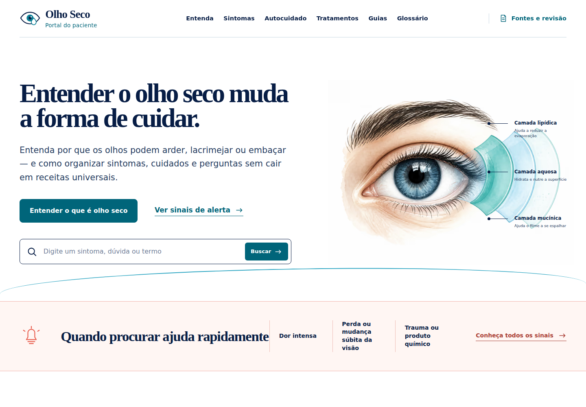

**Pontos fortes**

- identidade reconhecível e consistente;
- mensagem principal clara;
- ação primária, busca e sinais de alerta são descobertos rapidamente;
- a ilustração explica o filme lacrimal sem aparência promocional.

**Riscos**

- CTA principal, link secundário e busca disputam atenção;
- os rótulos da ilustração são pequenos em relação ao restante da página;
- o bloco de urgência fica visualmente separado, mas aparece apenas parcialmente
  na primeira dobra.

### 2. Busca por “lentes de contato” — precisa de ajuste

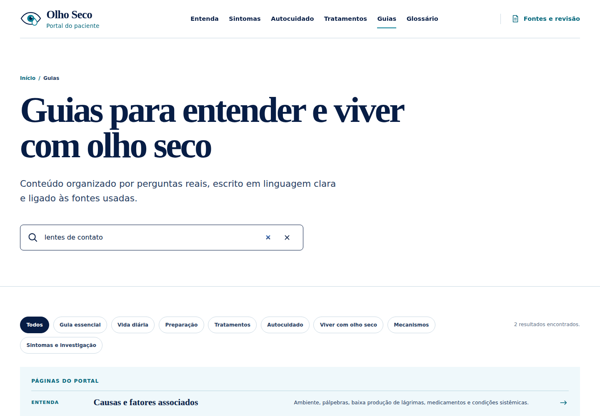

**Pontos fortes**

- retorno imediato, sem recarregar a página;
- quantidade de resultados anunciada;
- busca alcança guias e páginas centrais.

**Riscos**

- o campo `type="search"` mostra o botão nativo de limpar e a interface adiciona
  outro botão, produzindo dois “X”;
- há espaço vertical excessivo entre a busca e os resultados;
- os filtros quebram em duas linhas com um item isolado;
- mesmo após buscar, o primeiro resultado aparece apenas no fim da dobra.

### 3. Abertura do guia no desktop — boa, com fricção

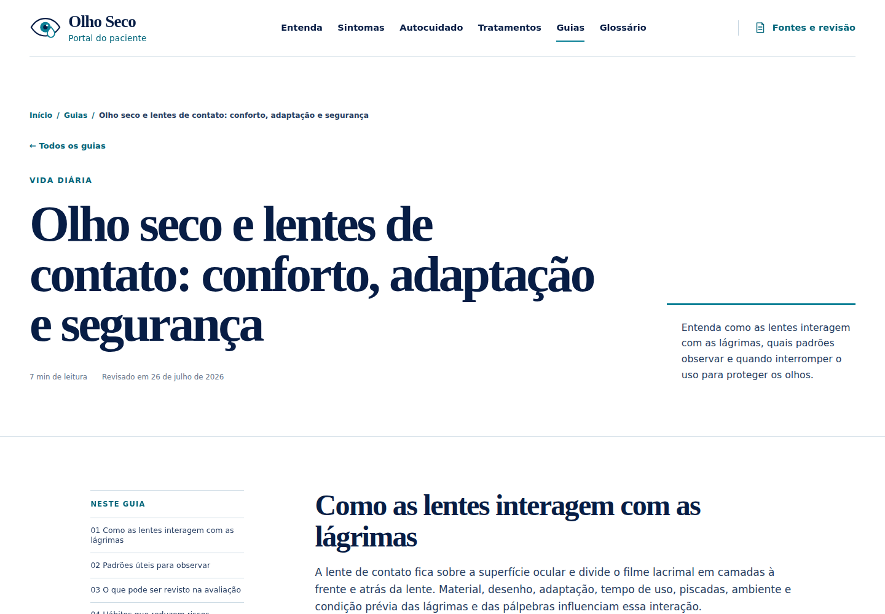

**Pontos fortes**

- título, categoria, tempo de leitura e revisão reforçam confiança;
- resumo lateral cria uma boa introdução;
- índice fixo ajuda em textos longos.

**Riscos**

- o cabeçalho consome quase uma tela inteira antes do conteúdo;
- o título tem presença editorial maior do que a tarefa de começar a leitura;
- o breadcrumb repete o título completo e fica visualmente pesado.

### 4. Página inicial no mobile — precisa de ajuste prioritário

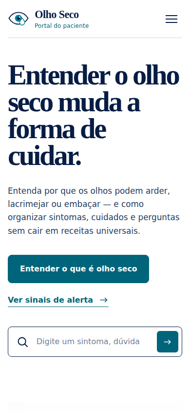

**Pontos fortes**

- marca e menu são legíveis;
- o CTA tem alvo amplo;
- a hierarquia básica permanece compreensível.

**Riscos**

- o título ocupa cinco linhas e domina a maior parte da primeira dobra;
- o texto do campo de busca é cortado;
- o botão da busca perde o rótulo visível e mostra apenas uma seta;
- ilustração, caminhos rápidos e alerta ficam abaixo da dobra;
- o usuário precisa interpretar a proposta do portal antes de encontrar uma
  entrada adequada ao seu caso.

### 5. Menu mobile aberto — regular

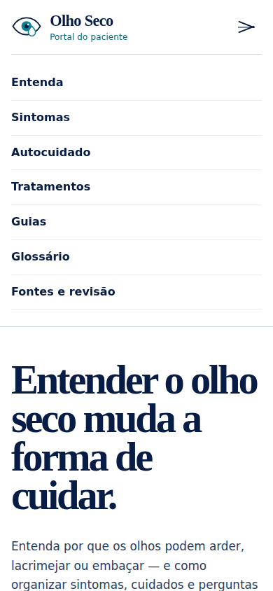

**Pontos fortes**

- linhas têm área de toque confortável;
- rótulos são simples e previsíveis;
- a ordem acompanha a arquitetura do portal.

**Riscos**

- a marca desaparece visualmente quando o menu abre, deixando apenas o “X”;
- falta uma resposta para a tecla Escape;
- o menu empurra o conteúdo e não oferece uma indicação de contexto além do
  botão de fechar.

### 6. Início de um guia no mobile — precisa de ajuste prioritário

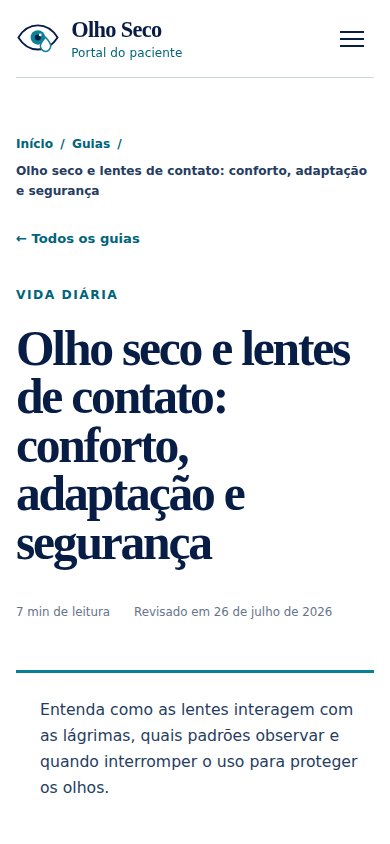

**Pontos fortes**

- categoria, tempo de leitura e revisão continuam visíveis;
- o resumo introdutório é claro.

**Riscos**

- breadcrumb e título ocupam praticamente toda a primeira tela;
- nenhum parágrafo do conteúdo aparece antes da primeira rolagem;
- o título atual quebra em muitas linhas e dificulta a leitura rápida;
- o índice do guia só aparece depois do cabeçalho.

### 7. Leitura do guia no mobile — boa

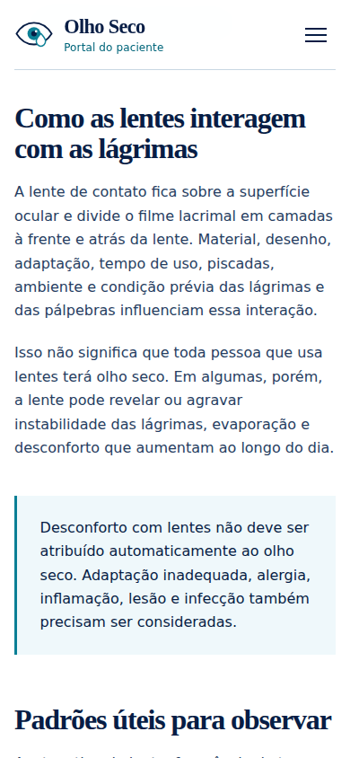

**Pontos fortes**

- corpo de texto confortável, com bom contraste e espaçamento;
- títulos e notas são distinguíveis;
- a largura de linha funciona bem para leitura contínua.

**Riscos**

- notas longas ganham muito peso visual;
- a ausência de progresso ou indicação da seção atual pode dificultar a
  orientação em guias maiores.

### 8. Caminhos de entrada no desktop — muito boa

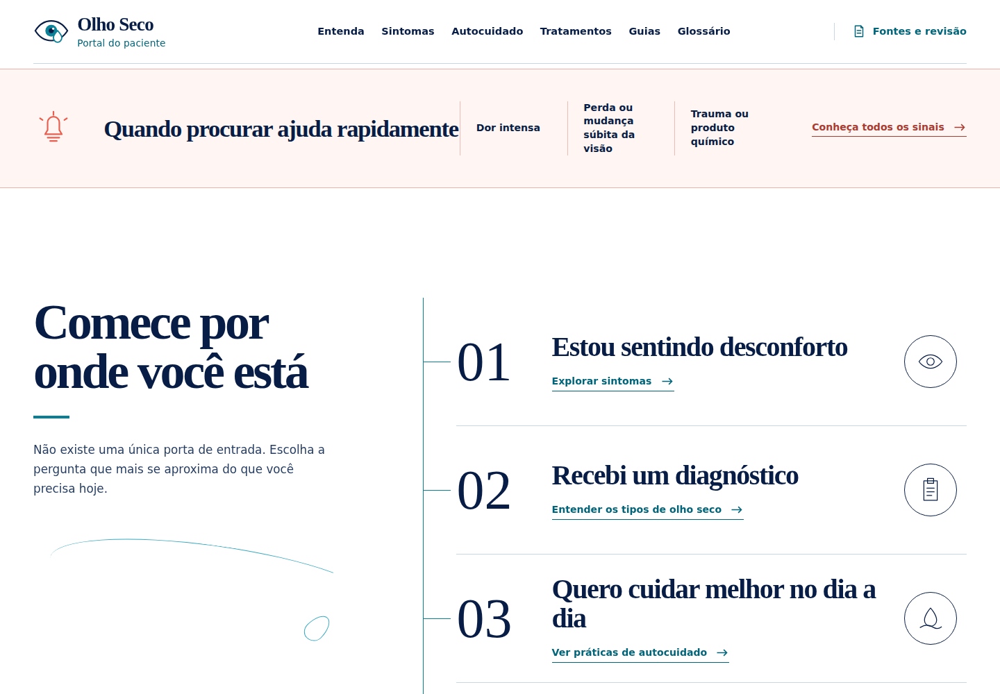

Este é um dos componentes mais fortes do portal. Transforma necessidades reais
em três escolhas compreensíveis, mantém o visual editorial e evita uma grade
genérica de cartões. A principal oportunidade é trazer uma versão compacta
desse padrão para a primeira dobra mobile.

## Acessibilidade

### Forças confirmadas no código e na interação

- link para pular ao conteúdo;
- navegação semântica e `aria-current`;
- foco visível com contorno sólido;
- campo de busca com rótulo acessível;
- contagem de resultados com `role="status"` e `aria-live`;
- filtros com estado `aria-pressed`;
- botão de menu com `aria-expanded`, `aria-controls` e rótulo atualizado;
- suporte a `prefers-reduced-motion`.

### Riscos prováveis

- dois controles de limpeza no campo de busca podem confundir usuários;
- o menu não fecha com Escape;
- títulos e breadcrumbs muito extensos aumentam a carga de leitura no zoom e em
  telas pequenas;
- links de âncora dos guias precisam ser testados com o cabeçalho fixo para
  garantir que o título da seção não fique encoberto;
- o estado de foco, a ordem completa de tabulação e a experiência com leitor de
  tela ainda precisam de teste assistivo dedicado.

Esta auditoria não afirma conformidade integral com WCAG. As capturas permitem
avaliar hierarquia, reflow e affordances visíveis; leitor de tela, zoom de 200%,
alto contraste e combinações de teclado precisam de uma rodada própria.

## Recomendações priorizadas

### Alta prioridade

1. **Compactar a entrada mobile.** Reduzir o título para aproximadamente
   42–48 px, encurtar o texto introdutório e trazer busca, caminhos ou segurança
   para a primeira dobra.
2. **Aproximar busca e resultados.** Reduzir o padding do cabeçalho quando há
   termo ativo, manter apenas um botão de limpar e recolher ou simplificar os
   filtros durante a busca.
3. **Compactar o cabeçalho dos guias.** Não repetir o título completo no
   breadcrumb, reduzir a escala do H1 e mostrar o início do conteúdo ou um
   resumo acionável na primeira tela.
4. **Adaptar “Comece por onde você está” ao mobile.** Reutilizar o componente
   existente como lista compacta de três caminhos, em vez de introduzir uma
   grade genérica de cards.

### Prioridade média

5. **Adicionar orientação de leitura.** Usar barra de progresso discreta e um
   índice recolhível no mobile; manter o índice fixo no desktop.
6. **Refinar o menu mobile.** Preservar marca e cabeçalho, fechar com Escape e
   devolver foco ao botão.
7. **Reduzir espaços editoriais em páginas de tarefa.** Busca, glossário e
   guias podem usar cabeçalhos mais compactos do que páginas institucionais.
8. **Evitar chips órfãos.** Limitar filtros a uma linha rolável no mobile e
   reorganizar ou agrupar categorias no desktop.

## Componentes sugeridos

- `MobileJourneyNavigator`: versão compacta dos três caminhos existentes;
- `PortalSearch`: busca com um único controle de limpeza, sugestões e resultados
  próximos;
- `GuideReadingHeader`: breadcrumb curto, metadados, progresso e índice
  recolhível;
- `SafetyStrip`: alerta persistente, discreto e claramente separado da
  orientação educativa;
- `MobileNavigation`: menu expansível com preservação da marca, Escape e retorno
  de foco.

O projeto é Astro sem React/Tailwind. Os padrões do shadcn mais próximos seriam
`Command`, `Accordion`, `Sheet` e `Progress`, mas importar shadcn apenas para
esses componentes aumentaria a complexidade. A implementação recomendada é
reproduzir os mesmos padrões acessíveis em Astro nativo.

## Conceitos gerados

### Conceito 1

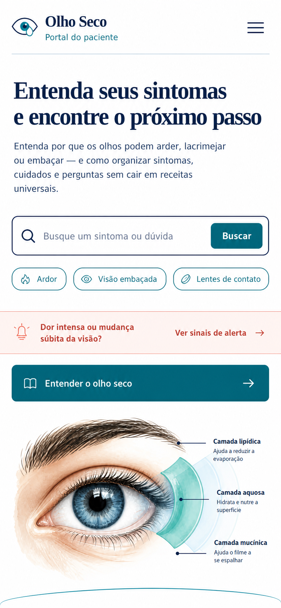

Busca como ação principal, sugestões por sintoma e faixa de segurança acima da
dobra.

### Conceito 2

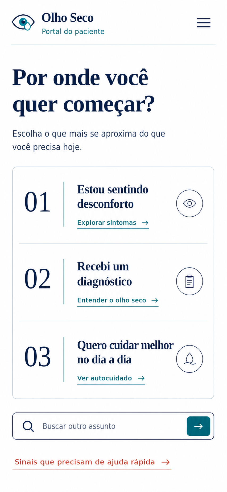

Adaptação mobile do melhor componente já existente no portal: os três caminhos
de entrada.

### Conceito 3

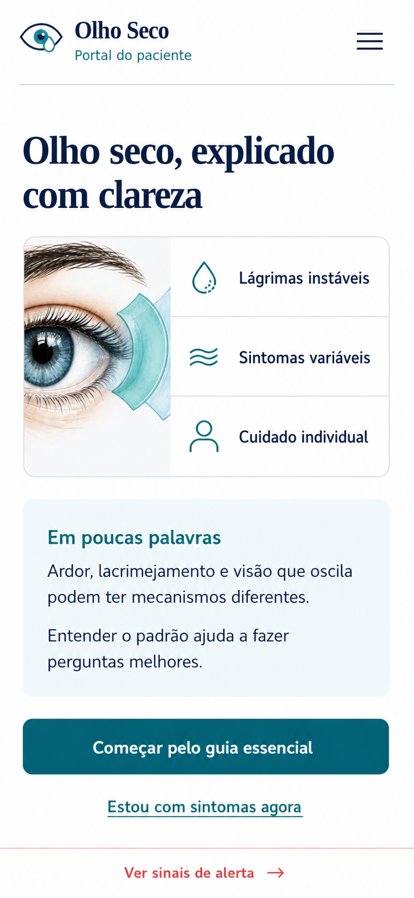

Introdução educativa compacta, resumo em linguagem simples e uma única ação
principal.

### Direção combinada selecionada

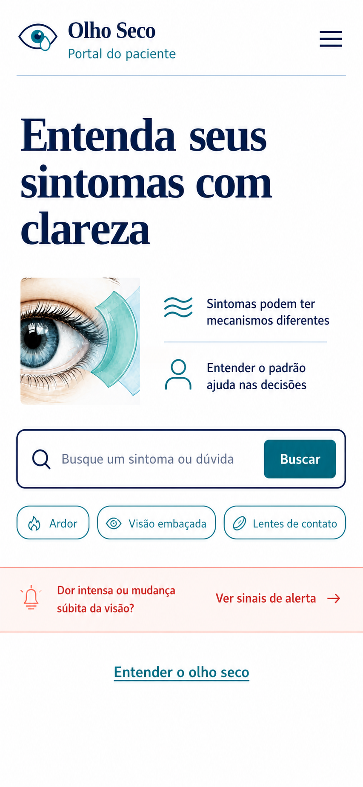

Combinação solicitada dos conceitos 1 e 3. A busca permanece como ação
principal; o enquadramento educativo foi condensado em duas mensagens, e o
alerta continua visível antes da primeira rolagem.

### Implementação aprovada no design QA

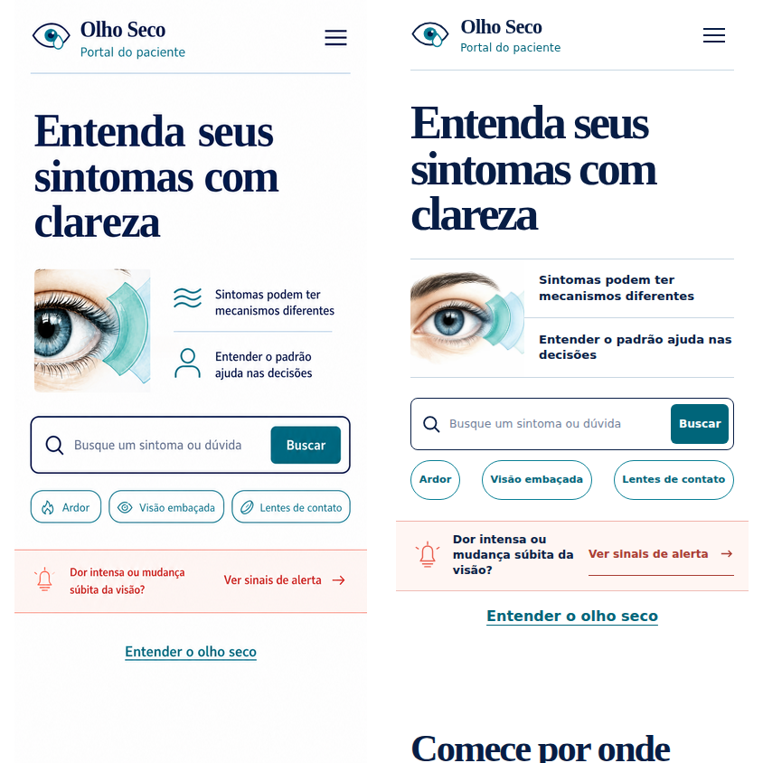

A direção combinada foi implementada na página inicial mobile. Busca, sugestões
e links são funcionais; o desktop foi preservado. O relatório completo da
comparação está em `design-qa.md`, na raiz do projeto.

## Prompt set usado

Todos os conceitos foram gerados pelo modo integrado do GPT Image com as
capturas atuais anexadas como referência. Restrições comuns: preservar marca,
paleta, tipografia e tom editorial; português do Brasil; viewport mobile
390 × 844; alvos de toque legíveis; nenhum agendamento, profissional, produto,
métrica, coleta de dados ou estética genérica de aplicativo médico.

- Conceito 1: priorizar busca, três sugestões e alerta visível.
- Conceito 2: adaptar a lista “Comece por onde você está” para o mobile.
- Conceito 3: combinar ilustração educativa, “Em poucas palavras” e CTA único.
- Direção combinada: unir busca, sugestões e faixa de segurança do conceito 1
  ao título e à síntese educativa do conceito 3, mantendo a busca como única
  ação primária.
