# Conceitos visuais — modernização 2026

Data: 6 de agosto de 2026  
Status: **direção A + progresso de B aprovada e implementada localmente; sem deploy**

## Como revisar

Abra o [protótipo interativo](prototipo-conceitos.html) em um navegador. A barra
superior alterna entre os conceitos A, B e C e entre os estados **Início**,
**Guia** e **Busca**. O botão de modo escuro é apenas uma avaliação visual local;
não representa decisão de implementação ou deploy.

As capturas abaixo foram renderizadas em Chromium nas dimensões exigidas para o
QA futuro: 1440 × 1000 e 390 × 844.

## Base comum aos três conceitos

- fundo branco real, azul profundo e teal; coral somente na faixa de segurança;
- títulos serifados e interface em sans-serif;
- primeira dobra compacta com busca, sugestões e segurança visíveis;
- versão mobile de “Comece por onde você está” como lista, não grade genérica;
- guias com breadcrumb curto, H1 compacto, progresso e sumário recolhível;
- busca com resultados imediatos, status `aria-live`, ação de limpar e filtros
  recolhidos quando existe query;
- linhas finas e motivo contínuo do filme lacrimal;
- foco teal e suporte conceitual a `prefers-reduced-motion`;
- nenhuma cidade, profissional, agendamento, captação, publicidade ou produto.

## A — Fluxo editorial compacto (recomendado)

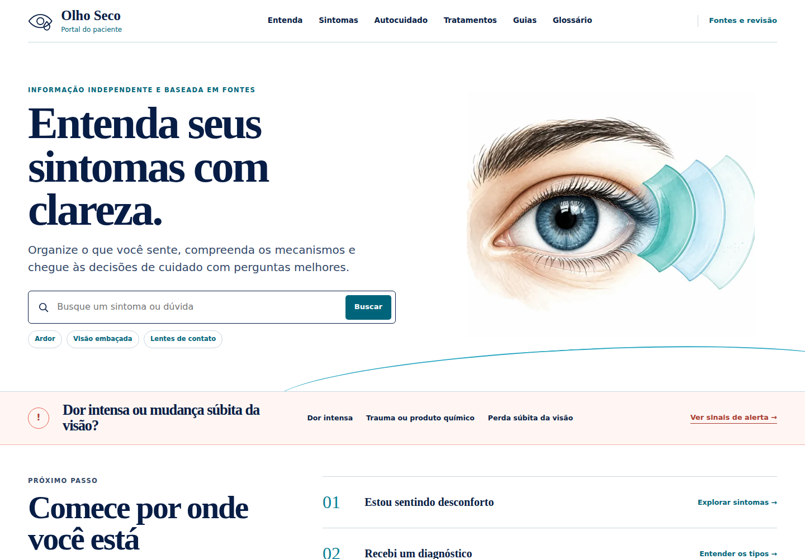

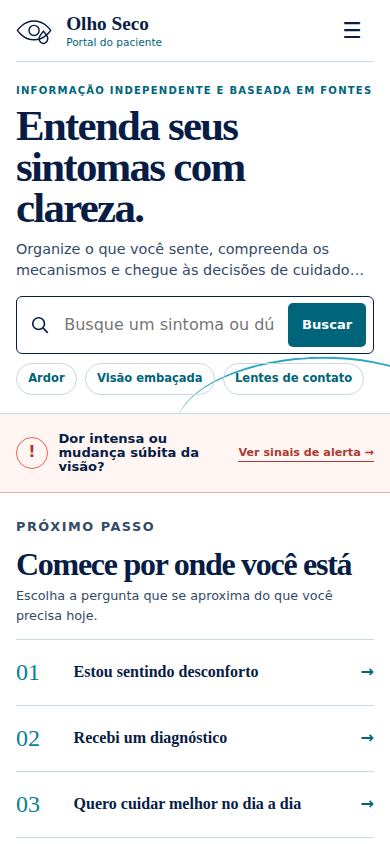

É a evolução de menor risco da identidade atual. Mantém composição aberta,
tipografia editorial, linhas finas e listas contínuas, mas elimina o excesso de
altura das entradas. O conteúdo e as tarefas ganham prioridade sem transformar
o portal em um aplicativo de cards.

**Vantagens:** maior continuidade visual; melhor densidade de informação;
implementação incremental simples em Astro/CSS; menor risco de regressão.

**Cuidado:** depende de uma escala tipográfica e de espaçamento muito bem
calibrada para não parecer apenas uma versão comprimida da interface existente.

### Estados críticos do conceito recomendado

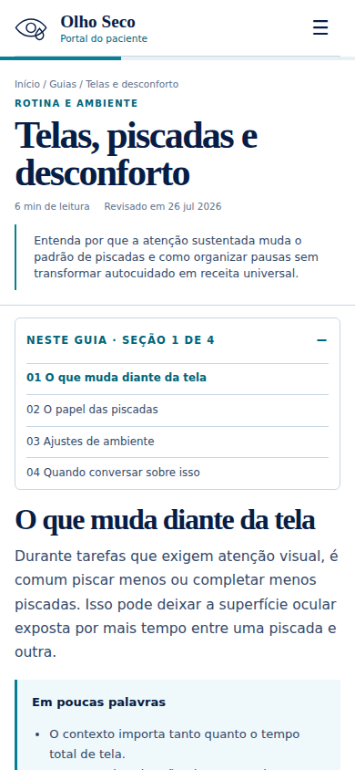

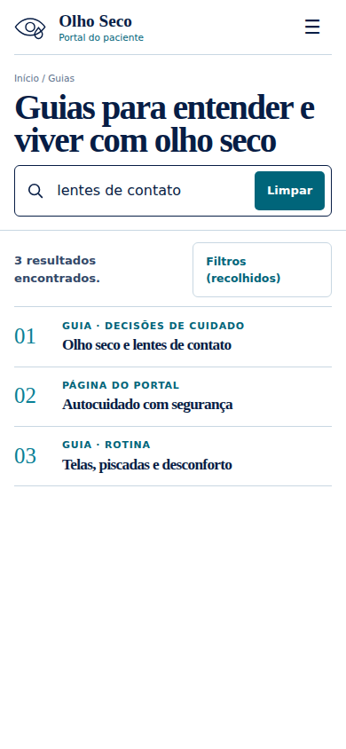

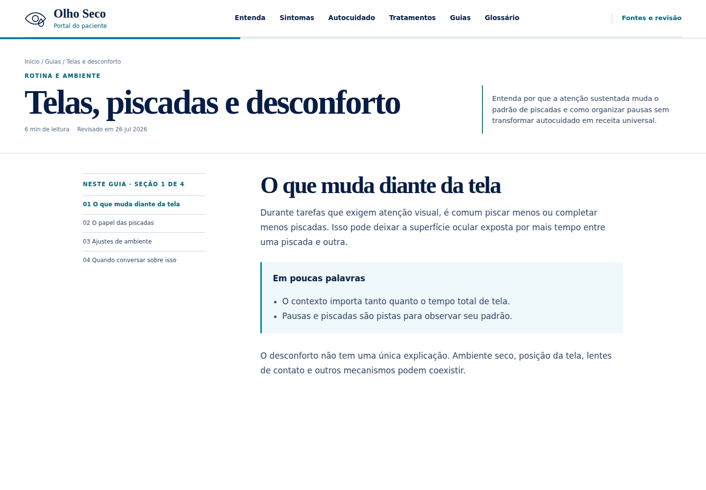

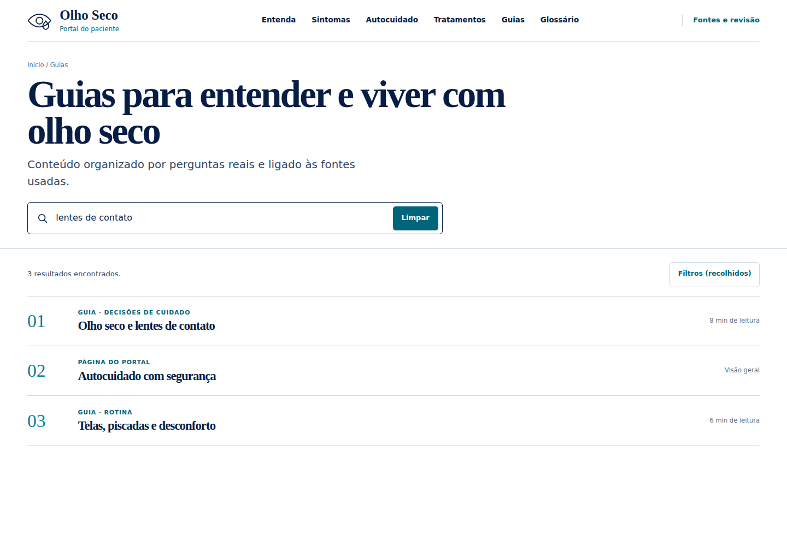

## B — Trilha guiada

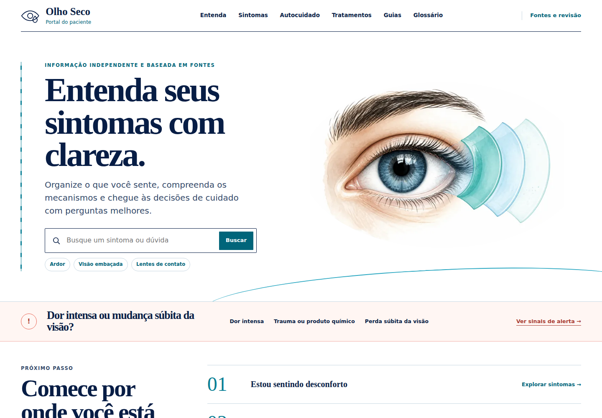

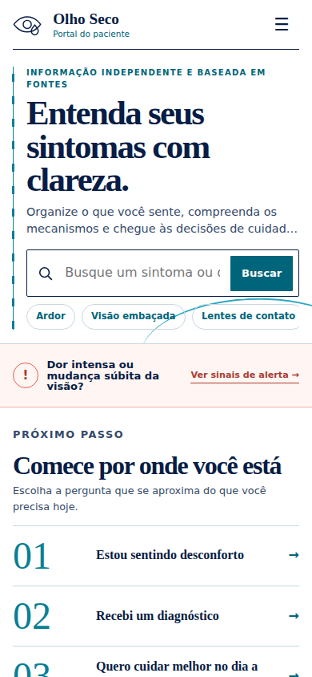

Torna orientação e sequência mais explícitas. A linha vertical, a numeração e a
seção ativa funcionam como uma trilha contínua entre entrada, leitura e próximo
passo.

**Vantagens:** excelente orientação em conteúdo longo; progresso e hierarquia
ficam evidentes; dialoga diretamente com o motivo do filme lacrimal.

**Cuidado:** é a direção mais didática e pode ganhar peso visual demais em
páginas clínicas curtas ou para quem prefere leitura menos dirigida.

## C — Camadas calmas

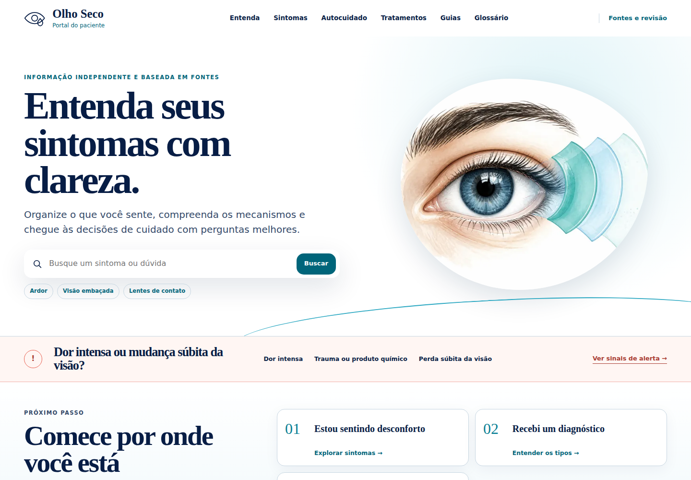

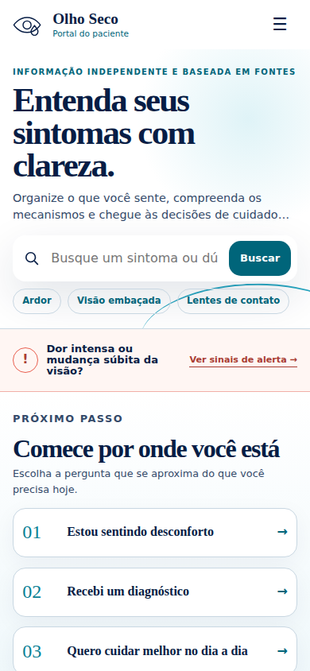

Usa superfícies claras, módulos suaves e sombras muito discretas para separar
decisões. É a direção mais próxima de uma linguagem digital contemporânea de
2026, sem abandonar a tipografia editorial.

**Vantagens:** hierarquia de cards mais perceptível; estados interativos mais
fáceis de reconhecer; boa base para componentes reutilizáveis.

**Cuidado:** tem maior risco de parecer um produto digital genérico e de reduzir
o caráter aberto/editorial que diferencia o portal.

## Avaliação opcional de modo escuro

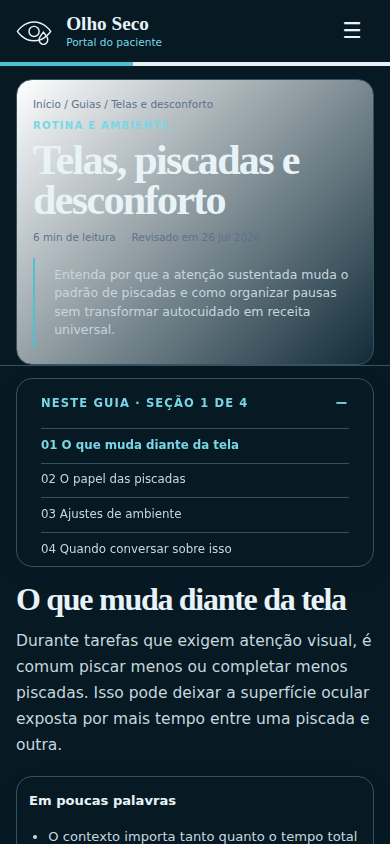

A amostra usa azul-noite, texto claro e teal luminoso, preservando coral apenas
para alertas. É tecnicamente viável como preferência explícita do usuário, mas
não deve substituir o branco como identidade padrão. Antes de qualquer
implementação seriam obrigatórias medições formais de contraste, revisão das
figuras educativas e definição do comportamento de `color-scheme`.

## Comparação e recomendação

| Critério                         | A · Fluxo editorial | B · Trilha guiada | C · Camadas calmas |
| -------------------------------- | ------------------- | ----------------- | ------------------ |
| Continuidade com a marca         | Muito alta          | Alta              | Média              |
| Orientação em guias              | Alta                | Muito alta        | Alta               |
| Densidade na primeira dobra      | Muito alta          | Alta              | Alta               |
| Risco de parecer “app genérico”  | Muito baixo         | Baixo             | Médio              |
| Complexidade de implementação    | Baixa               | Média             | Média              |
| Adequação à evolução incremental | Muito alta          | Alta              | Média              |

**Recomendação:** aprovar o conceito **A** como sistema principal e incorporar do
conceito **B** apenas o tratamento de seção ativa/progresso nos guias. O conceito
**C** pode informar elevação e agrupamento em poucos componentes de tarefa, sem
adotar uma grade generalizada de cards.

## Limites desta etapa

Os conceitos continuam sendo a referência visual. A implementação aprovada está
documentada no [relatório de implementação](implementation-report.md), e a
comparação normalizada entre referência e resultado está no
[Design QA](design-qa.md).

O modo escuro permanece somente como protótipo. Nenhuma alteração foi feita em
Nginx, CSP, IndexNow ou no diretório `dist` de produção; também não houve push ou
deploy.
